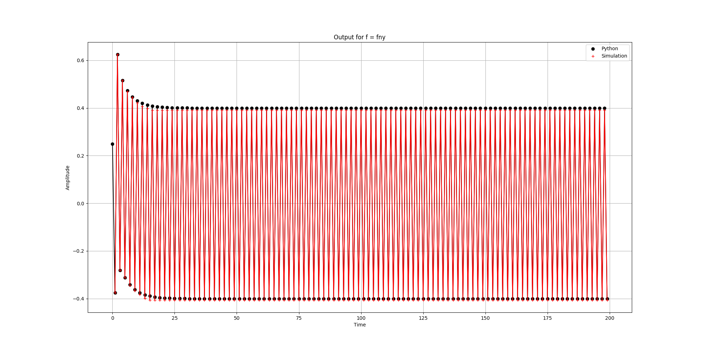
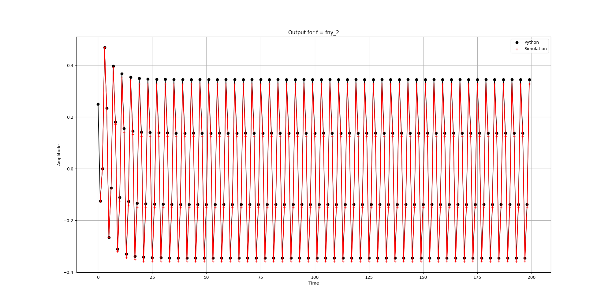

## Comparación Python - Simulación

A continuación se presentan gráficos comparando la salida obtenida al realizar el filtrado en Python, mediante la función `lfilter` de scipy, y la salida obtenida en simulación de la implementación en RTL, trabajando a la frecuencia de Nyquist (fny) y a la mitad de la frecuencia de Nyquist (fny_2).

### Excitando con fny (frecuencia de Nyquist)

### Excitando con fny_2 (la mitad de la frecuencia de Nyquist)

