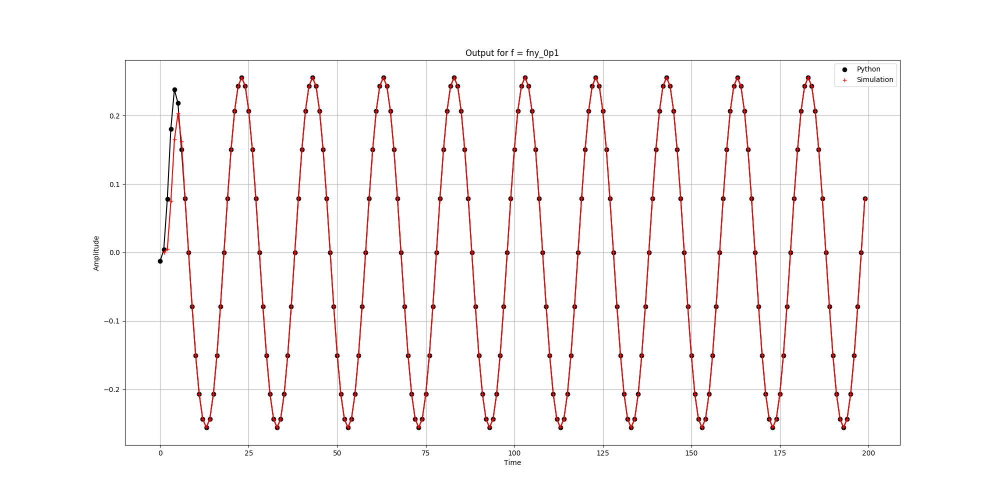
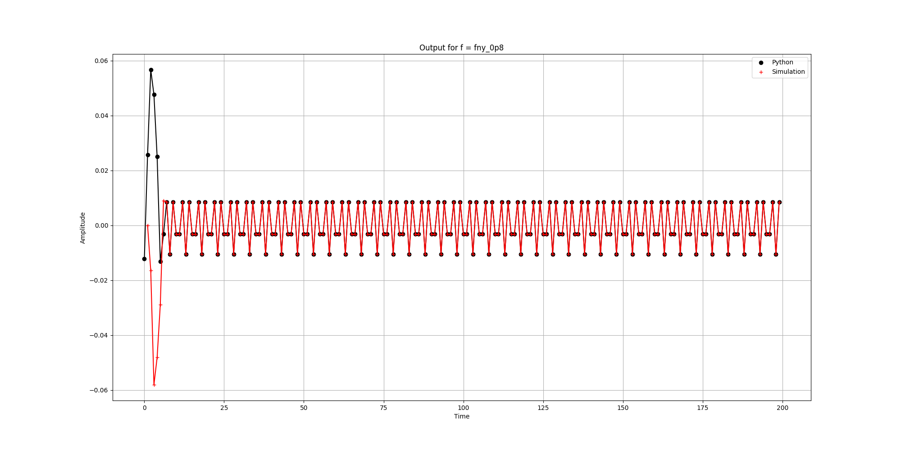
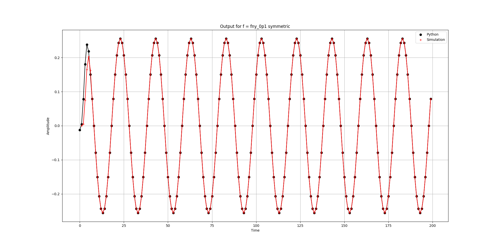
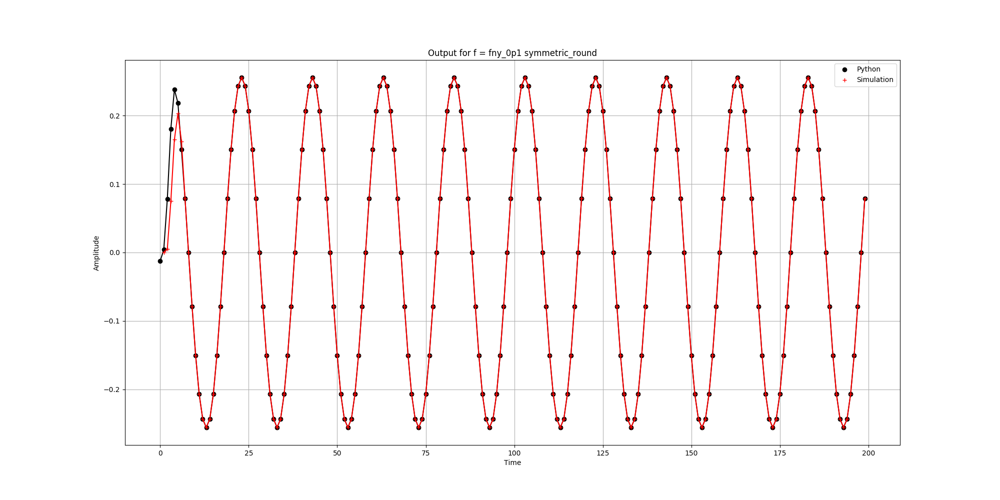
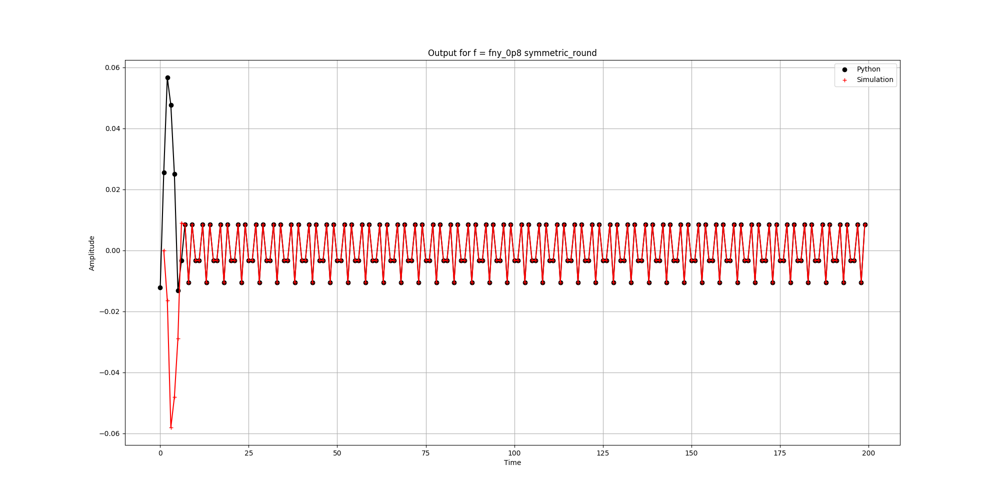
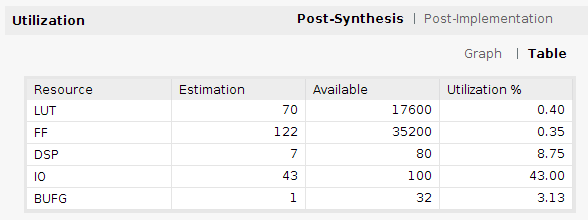
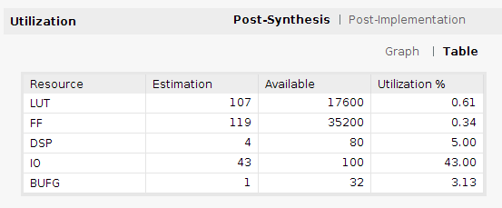

# Implementación en VHDL de filtro FIR con entradas/salidas AXIS

## Resoluciones utilizadas:
* Coeficientes del filtro: **Q1.15** - se diseña el filtro utilizando pyfda y luego se cuantizan los valores de los coeficientes con resolución Q1.15, colocando los valores obtenidos como constantes a utilizar en la implementación.
* Muestras de entrada: **Q1.15**.
* Resultado multiplicación: **Q2.16**. Se realiza el producto en máxima resolución (**Q2.30**), y luego se trunca/redondea el resultado para quedarse con 18 bits. Se debe notar que se mantiene toda la parte entera, por lo que no sería posible que ocurra saturación, por lo tanto el truncamiento se realiza de manera directa en la implementación.
* Salida del filtro: **Q5.16**. Se utiliza la máxima resolución requerida en base a las sumas realizadas con los productos en Q2.16 .

A continuación se presentan gráficos comparando la salida obtenida al realizar el filtrado en Python, mediante la función `lfilter` de scipy, y la salida obtenida en simulación de la implementación en RTL, trabajando a 0.1 de la frecuencia de Nyquist (fny_0p1) y a 0.8 de la frecuencia de Nyquist (fny_0p8). En todos los casos se calcula el MSE (Error Cuadrático Medio) entre los resultados de Python y los de la simulación, viéndose que son prácticamente iguales entre sí.

Debido a los parámetros del filtro diseñado, a 0.1fny el filtro deja pasar la señal sin atenuación, mientras que a 0.8fny la señal queda totalmente atenuada. Estos resultados se pueden apreciar en todas las implementaciones del filtro. En todos los casos la senal de entrada tiene una amplitud `A = 0.25`.

Todas las imágenes que se muestran se pueden generar corriendo el script `analyze_output_data.py`.

## Implementación con truncamiento
### Excitando con 0.1fny

`MSE = 0.0031681617452999325`

### Excitando con 0.8fny

`MSE = 0.00033411210278817355`

## Implementación simétrica con truncamiento
### Excitando con 0.1fny

`MSE = 0.003168090837184281`

### Excitando con 0.8fny

`MSE = 0.00033417761628593603`

## Implementación simétrica con redondeo
### Excitando con 0.1fny

`MSE = 0.0031680248687852896`

Al redondear el MSE es ligeramente menor que con truncamiento, aunque la diferencia es muy pequeña.

### Excitando con 0.8fny

`MSE = 0.00033428715871117425`

## Recursos utilizados (Arty Z7)

Uno de los recursos más preciados en una FPGA son los bloques DSP, por lo que utilizarlos sabiamente es muy importante. Se puede ver que básicamente se utiliza un bloque DSP para cada multiplicación entre las muestras de entrada y los coeficientes del filtro. En la implementación normal se realizan 7 multiplicaciones y en la simétrica solamente 4, lo cual se ve reflejado en los recursos DSP utilizados en cada caso.

#### Implementación normal

#### Implementación simétrica

